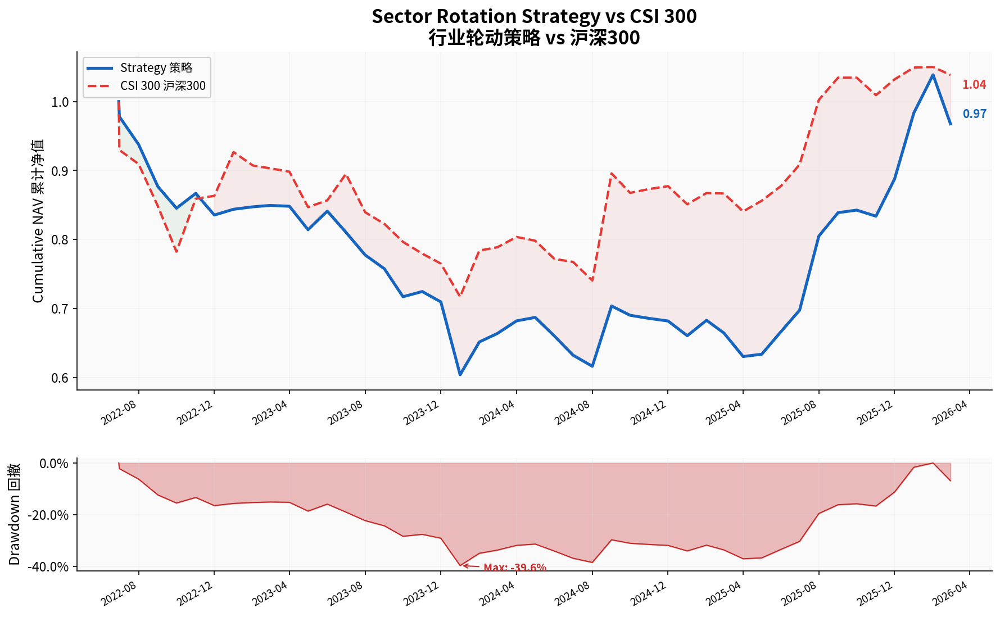
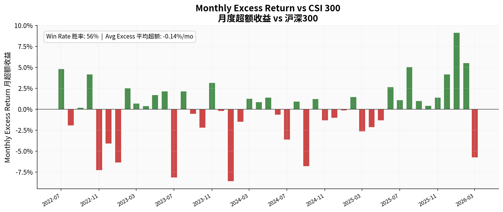
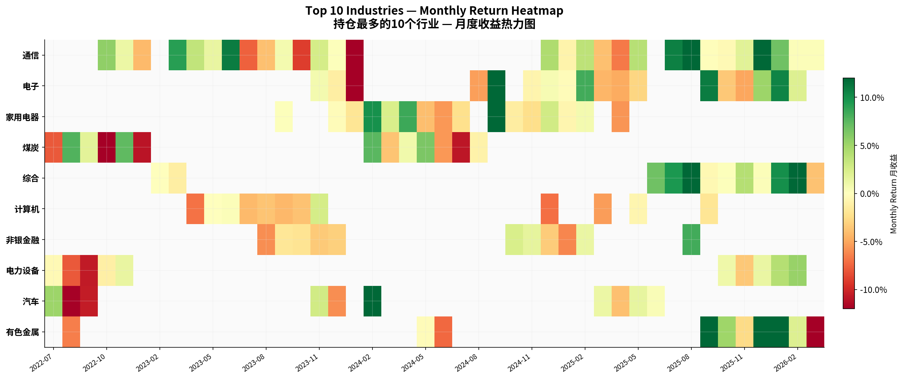
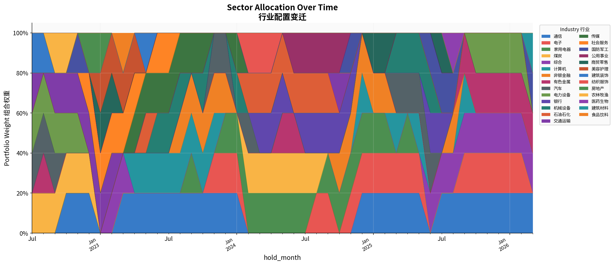
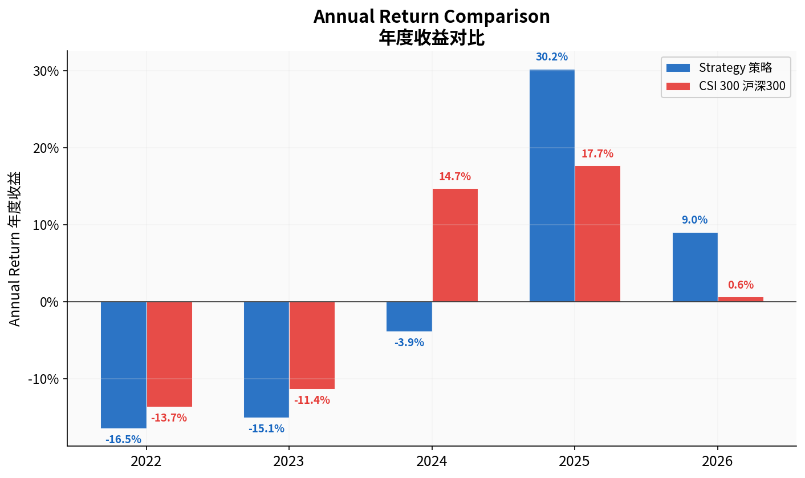

# Shenwan Sector Rotation Strategy | 申万行业轮动策略

A quantitative sector rotation strategy based on Shenwan Level-1 industry indices for the Chinese A-share market.

基于申万一级行业指数的A股行业轮动量化策略。

---

## Strategy Overview | 策略概述

### Investment Logic | 投资逻辑

**EN**: The strategy exploits sector-level **momentum** and **risk-adjusted return persistence** across Shenwan's 31 Level-1 industry classifications. Each month-end, industries are scored on three dimensions and the top 5 are held with equal weight for the following month.

**CN**: 策略利用申万31个一级行业的**动量效应**和**风险调整收益持续性**。每月末对行业在三个维度上打分，选择前5个行业等权持有至下月末。

### Factor Construction | 因子构建

| Factor 因子 | Description 描述 | Intuition 直觉 |
|------------|-----------------|---------------|
| **Momentum 动量** | 12-month cumulative return 12个月累计收益 | Industries with sustained upward trends 持续上涨趋势的行业 |
| **Risk-Adjusted Momentum 风险调整动量** | Return / Annualized Volatility 收益/年化波动率 | Favors high-return, low-volatility sectors 偏好高收益低波动行业 |
| **Turnover Trend 成交额趋势** | Recent 3-month avg volume / Prior period avg 近3月均量/前期均量 | Captures increasing institutional interest 捕捉机构关注度提升 |

Each factor is cross-sectionally ranked into percentiles (0–1) each month. The **composite score** is the equal-weighted average of the three factor ranks.

每月对每个因子做截面百分位排名（0–1），**综合评分**为三个因子排名的等权平均。

### Execution | 执行规则

- **Universe 投资范围**: 31 Shenwan Level-1 industry indices 申万31个一级行业
- **Rebalance 调仓频率**: Monthly (end of month) 月频（月末）
- **Signal Lag 信号滞后**: T-month score → T+1 month holding (no look-ahead bias) T月评分→T+1月持仓（无前视偏差）
- **Position Sizing 仓位**: Equal weight across top 5 industries 前5行业等权
- **Benchmark 基准**: CSI 300 Index 沪深300指数

---

## Results | 回测结果

### Performance Summary (Jun 2022 – Mar 2026) | 绩效汇总

| Metric 指标 | Strategy 策略 | CSI 300 沪深300 | Excess 超额 |
|-------------|--------------|----------------|------------|
| Total Return 总收益 | -3.22% | 3.86% | -7.08% |
| Annualized Return 年化收益 | -0.87% | 1.02% | -1.88% |
| Annualized Volatility 年化波动 | 19.07% | 18.16% | - |
| Sharpe Ratio 夏普比率 | -0.046 | 0.056 | - |
| Max Drawdown 最大回撤 | -38.27% | -22.90% | - |
| Information Ratio 信息比率 | - | - | -0.145 |
| Monthly Win Rate 月度胜率 | - | - | 55.6% |

> **Note 说明**: The backtest period (2022–2026) includes the severe A-share bear market (2022–2024 H1) followed by a sharp recovery. The strategy significantly outperformed in 2025 (+30.2% vs +17.7%) but underperformed during the drawdown phase due to momentum's inherent lag in trend reversals.
>
> 回测区间（2022–2026）覆盖了A股严重熊市（2022–2024上半年）及随后的强劲反弹。策略在2025年大幅跑赢（+30.2% vs +17.7%），但在下跌阶段因动量因子固有的趋势反转滞后而跑输。

### Key Charts | 核心图表

#### Cumulative NAV & Drawdown | 净值曲线与回撤


#### Monthly Excess Return vs CSI 300 | 月度超额收益


#### Top 10 Held Industries – Return Heatmap | 持仓行业收益热力图


#### Sector Allocation Over Time | 行业配置变迁


#### Annual Return Comparison | 年度收益对比


---

## Project Structure | 项目结构

```
sector-rotation/
├── main.py                     # Main pipeline runner 主运行脚本
├── src/
│   ├── data_fetcher.py         # AKShare data acquisition & factor computation 数据获取与因子计算
│   ├── backtest.py             # Backtest engine & performance analytics 回测引擎与绩效分析
│   └── visualizations.py       # Professional chart generation 可视化
├── data/                       # Cached CSV data (auto-generated) 缓存数据
│   ├── sw_industry_list.csv
│   ├── sw_industry_daily.csv
│   └── csi300_daily.csv
├── output/                     # Results & figures 结果与图表
│   ├── portfolio_returns.csv
│   ├── holdings_history.csv
│   ├── factor_scores.csv
│   ├── performance_metrics.json
│   └── figures/
├── requirements.txt
└── README.md
```

---

## Quick Start | 快速开始

### Installation | 安装

```bash
git clone https://github.com/YOUR_USERNAME/sector-rotation.git
cd sector-rotation
pip install -r requirements.txt
```

### Run Full Pipeline | 运行完整流程

```bash
# Fetch data + backtest + generate charts | 获取数据 + 回测 + 生成图表
python main.py

# Use cached data (skip API calls) | 使用缓存数据
python main.py --no-fetch
```

### Custom Parameters | 自定义参数

```bash
# Hold top 3 industries with 6-month lookback, starting from 2023
# 持有前3行业，6个月回看窗口，从2023年开始
python main.py --top-n 3 --lookback 6 --start 2023-01
```

| Parameter 参数 | Default 默认 | Description 描述 |
|---------------|-------------|-----------------|
| `--no-fetch` | False | Skip data fetching 跳过数据获取 |
| `--top-n` | 5 | Number of industries to hold 持有行业数 |
| `--lookback` | 12 | Factor lookback window (months) 因子回看窗口（月） |
| `--start` | 2022-06 | Backtest start month 回测起始月 |

---

## Data Sources | 数据来源

- **Industry Indices 行业指数**: [Shenwan Research 申万研究](https://www.swsresearch.com/) via AKShare
- **Benchmark 基准**: CSI 300 Index 沪深300 via China Securities Index Co., Ltd.

All data is fetched in real-time via the [AKShare](https://github.com/akfamily/akshare) open-source library (no API key required).

所有数据通过 [AKShare](https://github.com/akfamily/akshare) 开源库实时获取（无需API密钥）。

---

## Technical Notes | 技术说明

### Why Momentum-Based? | 为什么用动量因子？

**EN**: AKShare's free API provides reliable historical price/volume data for Shenwan indices but does not offer time-series fundamental data (historical PE/ROE/revenue by industry-month). As a result, the factor model uses price momentum, risk-adjusted momentum, and turnover trend as proxy signals. These are well-documented factor premia in Chinese equity markets.

**CN**: AKShare免费接口提供可靠的申万行业历史价量数据，但不提供基本面时间序列数据（历史PE/ROE/营收按行业-月度）。因此因子模型使用价格动量、风险调整动量和成交额趋势作为代理信号，这些是中国权益市场中有充分文献支持的因子溢价。

### Look-Ahead Bias Prevention | 前视偏差防范

- Scoring uses only information available at the signal date (T-month data → T+1 month holding) 评分仅使用信号日之前的信息
- Monthly returns are computed from daily close prices 月收益由日收盘价计算
- No survivorship bias: all 31 Shenwan industries are included throughout 无幸存者偏差：全部31个行业始终纳入

---

## Future Improvements | 未来改进

- [ ] Add fundamental factors (PE/PB/ROE) via paid data sources 通过付费数据源添加基本面因子
- [ ] Implement transaction cost modeling 引入交易成本模型
- [ ] Test alternative lookback windows and top-N sensitivity 测试不同回看窗口和持仓数量敏感性
- [ ] Add sector-neutral constraints 添加行业中性约束
- [ ] Implement walk-forward optimization 实现滚动优化

---

## Author | 作者

Robert Ren 任禾 — Purdue University, B.S. Applied Statistics
